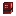

# Enchantments

IllyriaRPG adds four custom enchantments obtainable through the enchanting table,
anvils, and villager trading — just like vanilla enchantments.

<a class="card" href="embertread.html">

Embertread
Walk on lava — works on boots of any tier
</a>

<a class="card" href="nimbus.html">

Nimbus
Faster Happy Ghast flight — works on harnesses of any color
</a>

<a class="card" href="tether.html">

Tether
Auto-collect drops — works on tools and weapons
</a>

<a class="card" href="vinemine.html">

Vinemine
Break entire ore veins in one swing
</a>

<a class="card" href="vanilla-tweaks.html">

Vanilla Tweaks
Adjusted behavior for Feather Falling, Fortune, and Silk Touch
</a>

