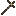
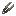

# Tether

Keep entities close at hand.

| Property   | Value                                                                                                                                                                                                                                                                                                                                                                     |
| ---------- | ------------------------------------------------------------------------------------------------------------------------------------------------------------------------------------------------------------------------------------------------------------------------------------------------------------------------------------------------------------------------- |
| Applies To |                                                                                                                                                                                                                                                                                                                                                                  |
| Max Level  | 1                                                                                                                                                                                                                                                                                                                                                                          |
| Source     |                                                                                                        |

## Effect

Allows you to tether entities to items, extending your interaction possibilities.
Pairs with [Vinemine](vinemine.md) — when both enchantments are on a tool, vein-mined drops are automatically
collected.
