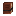
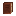

# Chiseled Bookshelf Storage

Peek inside chiseled bookshelves without opening the inventory.

## How It Works

**Left-click** the **front face** of a chiseled bookshelf to see what's stored in the slot you're looking at.
The contents appear as an action bar message.

## What You See

| Content Type                                                                                            | Display                        |
| :-----------------------------------------------------------------------------------------------------: | ------------------------------ |
|             | Book icon + title + author     |
|      | Book icon + stored enchantments |
|             | Item icon only                 |

## Details

- Uses ray casting to detect exactly which slot (out of 6) you're pointing at
- Shows the sprite icon of the stored item
- Works in Survival and Adventure modes
- Only works when clicking the front face of the bookshelf
