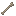

# Entity Tweaks

Quality-of-life adjustments to mobs and ambient entities.

| Entity                                                                                                              | Change                     |
| :-----------------------------------------------------------------------------------------------------------------: | -------------------------- |
|                                        | Behavior adjustments       |
|                                      | Modified spawn/behavior    |
|  | Improved trades & behavior |
|  | Silenced annoying sounds   |
|                              | Extended taming features   |
|                                      | Enhanced spawn egg usage   |
