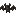
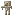
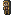
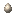

# Entity Tweaks

Quality-of-life adjustments to mobs and ambient entities.

## Bat 

Killing a bat drops **0–1 Phantom Membrane** when phantom spawning is disabled.

- The **Looting** enchantment increases drops by **+1 per level**
- Only applies when the `spawn_phantoms` gamerule is off, so membranes stay obtainable
  in worlds where phantoms are suppressed

## Husk 

Husks drop extra sand, with a bonus for camel jockeys.

- **Husk:** drops **0–2 Sand** on death
- **Husk riding a Camel:** drops **0–3 Sand** on death
- **Looting** adds **+1 per level** on a regular husk, **+2 per level** on a camel-riding husk

## Silencing Mobs 

Silence any non-hostile mob by clicking it with an **Amethyst Shard**.

1. Hold an **Amethyst Shard** in your hand.
2. **Right-click the mob** — the shard is consumed and the mob's sounds toggle off.
3. Right-click again with another shard to un-silence it.

Visual feedback appears as colored particles:

- **Red** — mob is now silenced
- **Green** — mob's sounds are back on

Notes:

- Does not work on players or hostile mobs (monsters cannot be silenced this way)
- The shard is **not consumed in Creative mode**

## Wandering Trader 

Wandering traders run a shared **custom shop** instead of their vanilla offers.

- Right-click any wandering trader to open a category picker — items the trader has in stock are
  grouped into Building Blocks, Tools & Weapons, Food & Farming, Materials, Redstone & Utility, and Misc
- **Buy** items from the shop using any accepted currency: Copper Ingots, Gold Ingots, Diamonds,
  or Emeralds, or a mix of all four — change is made automatically
- **Sell** items back to the trader via the Sell window; the trader pays in mixed currency at a
  fraction of the current buy price
- Prices shift with **supply and demand** — items frequently bought become pricier, items frequently sold become cheaper
- Stock is **shared across all wandering traders** on the server

## Spawn Eggs 

Rare chance to collect a mob's spawn egg by killing it.

- Every entity death has a **0.1% chance** to also drop that entity type's spawn egg
- Does not apply to entities that have no spawn egg in the game
