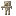

# Entity Tweaks

Quality-of-life adjustments to mobs and ambient entities.

## Husk 

Husks drop extra sand, with a bonus for camel jockeys.

- **Husk:** drops **0–2 Sand** on death
- **Husk riding a Camel:** drops **0–3 Sand** on death
- **Looting** adds **+1 per level** on a regular husk, **+2 per level** on a camel-riding husk

## Silencing Mobs 

Silence any non-hostile mob by clicking it with an **Amethyst Shard**.

1. Hold an **Amethyst Shard** in your hand.
2. **Right-click the mob** — the shard is consumed and the mob's sounds toggle off.
3. Right-click again with another shard to un-silence it.

Visual feedback appears as colored particles:

- **Red** — mob is now silenced
- **Green** — mob's sounds are back on

Notes:

- Does not work on players or hostile mobs (monsters cannot be silenced this way)
- The shard is **not consumed in Creative mode**

## Spawn Eggs 

Rare chance to collect a mob's spawn egg by killing it.

- Every entity death has a **0.1% chance** to also drop that entity type's spawn egg
- Does not apply to entities that have no spawn egg in the game
