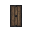
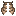
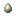
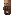
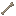

# Gameplay Changes

World and gameplay modifications that set IllyriaRPG apart.

<a class="card" href="anti-griefing.html">

Anti-Griefing

Built-in build protection
</a>

<a class="card" href="elytra-trims.html">

Elytra Trims

Armor-trim your elytra
</a>

<a class="card" href="entity-tweaks.html">

Entity Tweaks

QoL changes to mobs and ambient entities
</a>

<a class="card" href="mannequins.html">

Mannequins

Companion mannequins that follow, fight, and defend you
</a>

<a class="card" href="openables.html">

Openable Blocks

Doors and trapdoors with extended behavior
</a>

<a class="card" href="portal-restrictions.html">

Portal Restrictions

Spawn-protected Overworld portals
</a>

<a class="card" href="spawn-protection.html">

Spawn Protection

Safe zone around the Overworld spawn
</a>

<a class="card" href="tameable.html">

Pet Transfer

Give tamed pets to other players
</a>

<a class="card" href="trees.html">

Tree Mechanics

Improved tree behavior
</a>

