# Tree Mechanics

Vanilla trees are replaced with **custom tree structures** for a more natural, varied look when growing saplings.

## How It Works

Planting and growing a sapling (or using bone meal) spawns a hand-crafted custom tree structure instead of the
default vanilla tree. Each tree type has multiple structure variants chosen at random, so no two trees look exactly
alike.

## Supported Tree Types 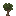

|                                                Sapling                                                 | Custom Variants |
| :----------------------------------------------------------------------------------------------------: | :-------------: |
|                           |       ✅        |
|         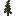         |       ✅        |
|          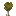           |       ✅        |
|         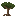         |       ✅        |
|         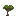         |       ✅        |
|      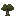      |       ✅        |
|                  |       ✅        |
|     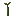     |       ✅        |
|            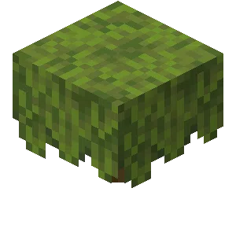             |       ✅        |
| 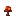 |       ✅        |
|     |       ✅        |
|    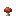    |       ✅        |
| 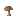 |       ✅        |
|                                                 Poplar                                                 |       ❌        |

## Notes

- Sapling growth behaves like vanilla — custom trees do not overwrite existing blocks such as stone or
  player-built structures
- Fungi and huge mushrooms also grow as custom variants
- Pale Oak is currently excluded due to an upstream Paper bug
