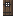
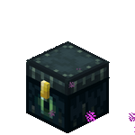
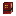
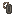
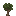
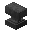
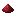
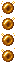

<!-- markdownlint-disable MD013 -->

# Illyria Wiki

Welcome to the official wiki for the **Illyria** Minecraft server.

## Categories

<a class="card" href="getting-started/joining.html">

Getting Started

How to connect, server rules, and the resource pack
</a>

<a class="card" href="datapacks/index.html">

Datapacks

Datapacks running on the server
</a>

<a class="card" href="enchantments/index.html">

Enchantments

Custom and tweaked enchantments
</a>

<a class="card" href="qol/index.html">

Quality of Life

Nicknames, XP bottling, and more
</a>

<a class="card" href="gameplay/index.html">

Gameplay Changes

Tree mechanics, openable blocks, anti-griefing, and more
</a>

<a class="card" href="recipes/index.html">

Recipes

Custom crafting and smithing recipes
</a>

<a class="card" href="mods/index.html">

Client Mod Support

Xaero's maps and Fabric/JEI integration
</a>

## About the Server

Illyria is a vanilla-plus Minecraft survival server with RPG flavor:

-  **Unique enchantments** like Vinemine (vein mining) and Embertread (lava walker)
-  **Quality-of-life features** — nicknames, XP bottling, and more
-  **Mod support** for Xaero's maps and Fabric/JEI users
