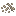
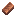
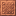
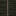
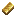
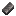
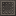
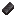
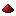
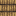

# Condensing

Quickly convert raw materials into their block form — and back.

## Usage

| Command       | Description                                          |
| ------------- | ---------------------------------------------------- |
| `/condense`   | Condenses all applicable items into blocks           |
| `/uncondense` | Splits blocks back into their base items             |

Both commands apply to your **entire inventory**.

## Supported Conversions

| Base Item                                                                                              | Block                                                                                              |
| :----------------------------------------------------------------------------------------------------: | :------------------------------------------------------------------------------------------------: |
|                 |                 |
|                                   |                                   |
|                                               |                                   |
|                         |                               |
|                                       |                             |
|                               |                     |
|                                       |                             |
|                               |                                   |
|                             |                                   |
|                               |                                   |
|                             |                                   |
|                         |                                 |
|                             |                                           |
|                             |                   |
|                 |                         |
|                                          |                               |
|                                      |                         |
|                               |                                 |
|                                             |                                       |

## Notes

- Conversion ratio is always **9 base items → 1 block**
- Overflows (when your inventory can't fit the output blocks) are dropped at your feet
- Nether wart, quartz, and melon have no vanilla reverse-recipe — `/uncondense` is the only way to split them
