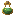

# Quality of Life

Small features that make everyday play more comfortable.

<a class="card" href="nicknames.html">

Nicknames

Change your display name with /nick
</a>

<a class="card" href="enderchest.html">

Ender Chest

Quick access to your ender chest from anywhere
</a>

<a class="card" href="xp.html">

XP Management

Bottle your experience at an enchanting table
</a>

<a class="card" href="anvil.html">

Anvil Improvements

Better anvil mechanics
</a>

<a class="card" href="condensing.html">

Condensing

Convert items to blocks and back with /condense and /uncondense
</a>

