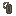

# Nicknames

Change your in-game display name with **MiniMessage** formatting support.

## Usage 

Run `/nick` (alias for `/nickname`) to open the nickname dialog.
Enter your desired name and confirm.

## MiniMessage Formatting

Nicknames support full MiniMessage syntax — colors, gradients, bold, and more.

### Examples

| Input                                       | Result                |
| ------------------------------------------- | --------------------- |
| `<red>Steve</red>`                          | Red name              |
| `<gradient:#FF0000:#0000FF>Alex</gradient>` | Gradient-colored name |
| `<bold><gold>Knight</gold></bold>`          | Bold, gold name       |

### RGB Gradients Made Easy

Use [birdflop.com/resources/rgb](https://www.birdflop.com/resources/rgb/) to generate gradient text:

1. Type your name on the site
2. Set output format to **MiniMessage**
3. Copy the output and paste it into the nickname dialog

> See the [MiniMessage docs](https://docs.papermc.io/adventure/minimessage/format/) for the full formatting syntax.

## Notes

- Nicknames are persistent across sessions
- The nickname shows in the tab list
- All players can use `/nick` by default
