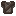
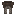
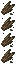

# Recipes

IllyriaRPG adds convenient vanilla-style recipes for common QoL needs.

## All Recipes

| Recipe                       | Method                                                                                                   | Input                                                                                                              | Output                                                                                                              |
| ---------------------------- | -------------------------------------------------------------------------------------------------------- | ------------------------------------------------------------------------------------------------------------------ | ------------------------------------------------------------------------------------------------------------------- |
| Chainmail Helmet¹            |  | 5 ×                         | 1 ×     |
| Chainmail Chestplate¹        |  | 8 ×                         | 1 ×  |
| Chainmail Leggings¹          |  | 7 ×                         | 1 ×  |
| Chainmail Boots¹             |  | 4 ×                         | 1 ×        |
| Wool to String          |  | 1 ×          | 4 ×                                   |
| Ice Breakdown           |  | 1 ×                            | 9 ×                       |
| Packed Ice Breakdown    |  | 1 ×                      | 9 ×                                            |
| Nether Wart Breakdown   |  | 1 ×  | 9 ×                    |
| Rotten Flesh to Leather²     |                       | 1 ×                | 1 ×                                |
| Wood to Log³                 |  | 1 ×   | 4 ×                    |
| Diamond Recycling⁴           |     | 1 ×  | 1 ×                                |
| Custom Paintings⁵            |           | 1 ×                 | 1 ×               |

## Notes

1. **Chainmail Armor** uses vanilla armor crafting patterns with Iron Bars
2. **Rotten Flesh** can be smelted in a furnace, smoker, or campfire
3. **Wood to Log** converts wood blocks (e.g. Oak Wood) back to 4 logs of the same type
4. **Diamond Recycling** accepts any diamond tool, weapon, or armor piece (including horse armor)
5. **Custom Paintings** — place any Painting in the stonecutter to choose a custom variant

## Weapon Recipes

For the custom RPG weapons, see the [Weapons](../weapons/index.md) section.
