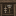

# Recipes

IllyriaRPG adds convenient vanilla-style recipes for common QoL needs.

## All Recipes

| Recipe                  | Method                                                                                          | Input                   | Output               |
| ----------------------- | ----------------------------------------------------------------------------------------------- | ----------------------- | -------------------- |
| Chainmail Helmet        |  | 5 Iron Bars             | Chainmail Helmet     |
| Chainmail Chestplate    |  | 8 Iron Bars             | Chainmail Chestplate |
| Chainmail Leggings      |  | 7 Iron Bars             | Chainmail Leggings   |
| Chainmail Boots         |  | 4 Iron Bars             | Chainmail Boots      |
| Wool to String          |  | 1 Wool (any color)      | 4 String             |
| Ice Breakdown           |  | 1 Blue Ice              | 9 Packed Ice         |
| Packed Ice Breakdown    |  | 1 Packed Ice            | 9 Ice                |
| Nether Wart Breakdown   |  | 1 Nether Wart Block     | 9 Nether Wart        |
| Rotten Flesh to Leather |                       | Rotten Flesh            | Leather              |
| Wood to Log             |  | 1 Wood Block (any type) | 4 Matching Logs      |
| Diamond Recycling       |     | 1 Diamond Tool/Armor    | 1 Diamond            |
| Custom Paintings        |           | 1 Painting + material   | 1 Custom Painting    |

## Notes

- **Chainmail Armor** uses vanilla armor crafting patterns with Iron Bars
- **Diamond Recycling** accepts any diamond tool, weapon, or armor piece (including horse armor)
- **Rotten Flesh** can be smelted in a furnace, smoker, or campfire
- **Wood to Log** converts wood blocks (e.g. Oak Wood) back to 4 logs of the same type
- **Custom Paintings** are cut via the stonecutter

## Weapon Recipes

For the custom RPG weapons, see the [Weapons](../weapons/index.md) section.
