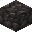

# Recipes

IllyriaRPG adds convenient vanilla-style recipes for common QoL needs.

## All Recipes

| Recipe                      | Type                                                                                                                                                                                                                                                                                                                                                                                                                                                                                                                                                                                                                                                                                                                                                                                                                                                                                                                                                                                                                                                                                                                                                                                                     |
| --------------------------- | -------------------------------------------------------------------------------------------------------------------------------------------------------------------------------------------------------------------------------------------------------------------------------------------------------------------------------------------------------------------------------------------------------------------------------------------------------------------------------------------------------------------------------------------------------------------------------------------------------------------------------------------------------------------------------------------------------------------------------------------------------------------------------------------------------------------------------------------------------------------------------------------------------------------------------------------------------------------------------------------------------------------------------------------------------------------------------------------------------------------------------------------------------------------------------------------------------- |
| Chainmail Helmet[^1]        | 

                                                                                                                                                                                                                                                                                                                                                                                        |
| Chainmail Chestplate[^1]    | 

 |
| Chainmail Leggings[^1]      | 

                                                                                                                                |
| Chainmail Boots[^1]         | 

                                                                                                                                                                                                                                                                                                                                                                                                                                                                                                                    |
| Wool to String              | 
4
                                                                                                                                                                                                                                                                                                                                                                                                                                                                                                                                                                                                                                                                                                                                                                                                                                                                |
| Ice Breakdown               | 
9
                                                                                                                                                                                                                                                                                                                                                                                                                                                                                                                                                                                                                                                                                                                                                                                                                                                             |
| Packed Ice Breakdown        | 
9
                                                                                                                                                                                                                                                                                                                                                                                                                                                                                                                                                                                                                                                                                                                                                                                                                                                                            |
| Nether Wart Breakdown       | 
9
                                                                                                                                                                                                                                                                                                                                                                                                                                                                                                                                                                                                                                                                                                                                                                                                                                     |
| Rotten Flesh to Leather[^2] | 

                                                                                                                                                                                                                                                                                                                                                                                                                                                                                                                                                                                                                                                                                                                                                                                                                                                                                                             |
| Wood to Log[^3]             | 
4
                                                                                                                                                                                                                                                                                                                                                                                                                                                                                                                                                                                                                                                                                                                                                                                                                      |
| Diamond Recycling[^4]       | 

                                                                                                                                                                                                                                                                                                                                                                                                                                                                                                                                                                                                                                                                                                                                                                                                                                                     |
| Custom Paintings[^5]        | 

                                                                                                                                                                                                                                                                                                                                                                                                                                                                                                                                                                                                                                                                                                                                                                                                                                    |
| Incendium Key[^6]           | 

                                                                                                                                                                                                                                                                                                                                                    |
| Nullscape Key[^6]           | 

                                                                                                                                                                                                                                                                                                                                           |

[^1]: **Chainmail Armor** uses vanilla armor crafting patterns with Iron Bars

[^2]: **Rotten Flesh** can be smelted in a furnace, smoker, or campfire

[^3]: **Wood to Log** converts wood blocks (e.g. Oak Wood, Crimson Hyphae) back to 4 logs of the same type. Stripped variants also work.

[^4]: **Diamond Recycling** accepts any diamond tool, weapon, or armor piece (including horse and nautilus armor)

[^5]: **Custom Paintings** — place any Painting in the stonecutter to choose a custom variant

[^6]: **Dimension Keys** — custom items required for Nether/End portal travel; crafted from Overworld materials
