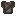
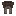
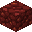
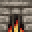
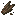
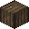
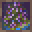

<!-- markdownlint-disable MD013 -->

# Recipes

Chainmail Helmet[1]

Chainmail Chestplate[1]

Chainmail Leggings[1]

Chainmail Boots[1]

Wool to String

4

Ice Breakdown

9

Packed Ice Breakdown

9

Nether Wart Breakdown

9

Rotten Flesh to Leather[2]

Wood to Log[3]

4

Diamond Recycling[4]

Custom Paintings[5]

---

1. **Chainmail Armor** uses vanilla armor crafting patterns with Iron Bars
2. **Rotten Flesh** can be smelted in a furnace, smoker, or campfire
3. **Wood to Log** converts wood blocks (e.g. Oak Wood, Crimson Hyphae) back to 4 logs of the same type. Stripped variants also work.
4. **Diamond Recycling** accepts any diamond tool, weapon, or armor piece (including horse and nautilus armor)
5. **Custom Paintings** — place any Painting in the stonecutter to choose a custom variant
