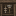
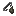

# Recipes

IllyriaRPG adds convenient vanilla-style recipes for common QoL needs.

## All Recipes

| Recipe                      | Method                                                                                                   | Input                                                                                                                                                                                                                                                                                                     | Output                                                                                                                           |
| --------------------------- | -------------------------------------------------------------------------------------------------------- | --------------------------------------------------------------------------------------------------------------------------------------------------------------------------------------------------------------------------------------------------------------------------------------------------------- | -------------------------------------------------------------------------------------------------------------------------------- |
| Chainmail Helmet[^1]        |  | 5 ×                                                                                                                                                                                                                | 1 ×                  |
| Chainmail Chestplate[^1]    |  | 8 ×                                                                                                                                                                                                                | 1 ×      |
| Chainmail Leggings[^1]      |  | 7 ×                                                                                                                                                                                                                | 1 ×            |
| Chainmail Boots[^1]         |  | 4 ×                                                                                                                                                                                                                | 1 ×                     |
| Wool to String              |  | 1 ×                                                                                                                                                                                                 | 4 ×                                                |
| Ice Breakdown               |  | 1 ×                                                                                                                                                                                                                   | 9 ×                                    |
| Packed Ice Breakdown        |  | 1 ×                                                                                                                                                                                                             | 9 ×                                                         |
| Nether Wart Breakdown       |  | 1 ×                                                                                                                                                                                        | 9 ×                                 |
| Rotten Flesh to Leather[^2] |                       | 1 ×                                                                                                                                                                                                       | 1 ×                                             |
| Wood to Log[^3]             |  | 1 ×                                                                                                                                                                                          | 4 ×                                 |
| Diamond Recycling[^4]       |     | 1 ×                                                                                                                                                                                    | 1 ×                                             |
| Custom Paintings[^5]        |           | 1 ×                                                                                                                                                                                                                   | 1 ×                            |
| Incendium Key[^6]           |  | 3 ×  + 1 ×  + 1 ×           | 1 ×  (unlocks Nether portals) |
| Nullscape Key[^6]           |  | 3 ×  + 1 ×  + 1 ×  | 1 ×  (unlocks End portals)    |

[^1]: **Chainmail Armor** uses vanilla armor crafting patterns with Iron Bars

[^2]: **Rotten Flesh** can be smelted in a furnace, smoker, or campfire

[^3]: **Wood to Log** converts wood blocks (e.g. Oak Wood) back to 4 logs of the same type

[^4]: **Diamond Recycling** accepts any diamond tool, weapon, or armor piece (including horse armor)

[^5]: **Custom Paintings** — place any Painting in the stonecutter to choose a custom variant

[^6]: **Dimension Keys** — custom items required for Nether/End portal travel; crafted from Overworld materials
