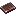

# Halberd

A polearm with extended reach for keeping enemies at bay.

## Stats

| Attribute     | Value                                                                                                                                 |
| ------------- | ------------------------------------------------------------------------------------------------------------------------------------- |
| Base Item     |                              |
| Attack Damage | 9.5                                                                                                                                   |
| Attack Speed  | 1.3                                                                                                                                   |
| Reach         | 4.0 blocks                                                                                                                            |

## Crafting

Upgrade a **Netherite Spear** in a smithing table:

| Slot     | Ingredient                                                                                                                                      |
| -------- | ----------------------------------------------------------------------------------------------------------------------------------------------- |
| Template |  |
| Base     |                                              |
| Addition |                                                         |

## Playstyle

The Halberd's extended reach (4 blocks instead of 3) lets you hit enemies before
they can hit you. Excellent for controlling distance in PvP and safely fighting
mobs.
