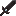
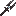

# Custom Weapons

IllyriaRPG adds three powerful end-game weapons, each crafted via the
**smithing table** using a Netherite Upgrade template and a rare material.

<div class="icon-table">

| Weapon                      | Base Item                                                                                          | Catalyst                                                                                        |
| --------------------------- | -------------------------------------------------------------------------------------------------- | ----------------------------------------------------------------------------------------------- |
| [Greatsword](greatsword.md) |  |  |
| [Halberd](halberd.md)       |  |  |
| [Longsword](longsword.md)   |  |     |

</div>

## Crafting

All weapons are upgraded in a **smithing table**:

```text
[Netherite Upgrade Template] + [Base Weapon] + [Catalyst] → [Custom Weapon]
```

Custom models and textures are provided by the server
[resource pack](../getting-started/resource-pack.md).
