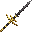
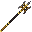
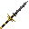

# Custom Weapons

IllyriaRPG adds three powerful end-game weapons, each crafted via the
**smithing table** using a Netherite Upgrade template and a rare material.

<a class="card" href="greatsword.html">

Greatsword
Heavy two-handed blade — highest damage, slowest swing
</a>

<a class="card" href="halberd.html">

Halberd
Polearm with 4-block reach for keeping enemies at bay
</a>

<a class="card" href="longsword.html">

Longsword
Swift blade trading raw damage for the fastest attack speed
</a>

